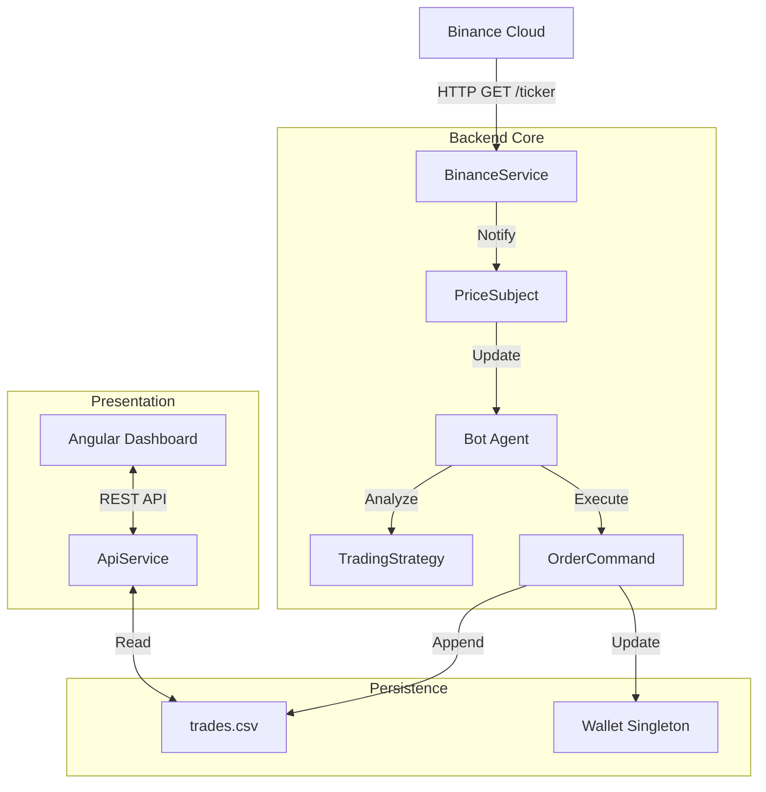

# AI-Powered Trading Bot: Technical Documentation

**Team 19**  
December 10, 2025

#### Abstract

This document provides comprehensive technical documentation for the **AI-Powered Trading Bot**, a Java-based algorithmic trading system that demonstrates proper implementation of six fundamental design patterns: **Strategy, Observer, Decorator, Command, Template Method, and Singleton**. The system performs real-time market analysis using Binance API, executes trades based on configurable strategies, and provides a modern Angular-based dashboard for monitoring. This documentation serves as both a technical reference and an educational resource for understanding enterprise-level design pattern implementations.

---

## Contents

1. [**Introduction**](#1-introduction)
    *   [1.1 Project Overview](#11-project-overview)
    *   [1.2 System Requirements](#12-system-requirements)
        *   [1.2.1 Functional Requirements](#121-functional-requirements)
        *   [1.2.2 Non-Functional Requirements](#122-non-functional-requirements)
    *   [1.3 Technology Stack](#13-technology-stack)
2. [**System Architecture**](#2-system-architecture)
    *   [2.1 High-Level Architecture](#21-high-level-architecture)
    *   [2.2 Layer Descriptions](#22-layer-descriptions)
        *   [2.2.1 Service Layer](#221-service-layer)
        *   [2.2.2 Core Layer](#222-core-layer)
        *   [2.2.3 Logic Layer](#223-logic-layer)
        *   [2.2.4 Execution Layer](#224-execution-layer)
        *   [2.2.5 Presentation Layer](#225-presentation-layer)
3. [**Design Patterns Implementation**](#3-design-patterns-implementation)
    *   [3.1 Strategy Pattern](#31-strategy-pattern)
        *   [3.1.1 Pattern Overview](#311-pattern-overview)
        *   [3.1.2 Implementation in Trading Bot](#312-implementation-in-trading-bot)
        *   [3.1.3 Concrete Strategies](#313-concrete-strategies)
    *   [3.2 Observer Pattern](#32-observer-pattern)
        *   [3.2.1 Pattern Overview](#321-pattern-overview)
        *   [3.2.2 Implementation in Trading Bot](#322-implementation-in-trading-bot)
    *   [3.3 Decorator Pattern](#33-decorator-pattern)
        *   [3.3.1 Pattern Overview](#331-pattern-overview)
        *   [3.3.2 Implementation in Trading Bot](#332-implementation-in-trading-bot)
    *   [3.4 Command Pattern](#34-command-pattern)
        *   [3.4.1 Pattern Overview](#341-pattern-overview)
        *   [3.4.2 Implementation in Trading Bot](#342-implementation-in-trading-bot)
    *   [3.5 Template Method Pattern](#35-template-method-pattern)
        *   [3.5.1 Pattern Overview](#351-pattern-overview)
        *   [3.5.2 Implementation in Trading Bot](#352-implementation-in-trading-bot)
    *   [3.6 Singleton Pattern](#36-singleton-pattern)
        *   [3.6.1 Pattern Overview](#361-pattern-overview)
        *   [3.6.2 Implementation in Trading Bot](#362-implementation-in-trading-bot)
4. [**Backend Implementation Details**](#4-backend-implementation-details)
    *   [4.1 Binance Service & Security](#41-binance-service--security)
        *   [4.1.1 HMAC Signature Generation](#411-hmac-signature-generation)
    *   [4.2 API Service](#42-api-service)
        *   [4.2.1 Request Handling](#421-request-handling)
    *   [4.3 Concurrency & Thread Safety](#43-concurrency--thread-safety)
5. [**Frontend Implementation**](#5-frontend-implementation)
    *   [5.1 Angular Architecture](#51-angular-architecture)
    *   [5.2 Real-time Dashboard](#52-real-time-dashboard)
6. [**API Documentation**](#6-api-documentation)
    *   [6.1 REST Endpoints](#61-rest-endpoints)
        *   [6.1.1 Trade History API](#611-trade-history-api)
        *   [6.1.2 Strategy Management API](#612-strategy-management-api)
    *   [6.2 Request/Response Examples](#62-requestresponse-examples)
7. [**Testing**](#7-testing)
    *   [7.1 Unit Tests](#71-unit-tests)
    *   [7.2 Integration Tests](#72-integration-tests)
8. [**Deployment**](#8-deployment)
    *   [8.1 Docker Deployment](#81-docker-deployment)
    *   [8.2 Systemd Service](#82-systemd-service)
9. [**Conclusion**](#9-conclusion)
    *   [9.1 Achievements](#91-achievements)
    *   [9.2 Future Enhancements](#92-future-enhancements)

---

# 1 Introduction

## 1.1 Project Overview

The AI-Powered Trading Bot is a high-frequency trading simulation and execution platform. Unlike traditional monolithic bots, this system is built on a loosely coupled architecture that allows for runtime strategy switching, dynamic risk management, and real-time data processing without system restart.

The primary educational objective is to showcase the correct implementation of Gang of Four (GoF) patterns in a financial domain context.

<br><br>
<br>


<br>

## 1.2 System Requirements

### 1.2.1 Functional Requirements
- **Real-time Data Stream:** The system must fetch price updates at least once per second (1Hz).
- **Dynamic Configuration:** Users must be able to change active strategies via a web dashboard.
- **Risk Management:** The system must automatically trigger a "Panic Sell" if prices drop >5% in 10 seconds.
- **Visual Dashboard:** A web interface must display live prices, active strategy, and portfolio balance.

### 1.2.2 Non-Functional Requirements
- **Latency:** Signal generation processing time must be under 50ms.
- **Reliability:** The system must handle API failures gracefully.
- **Extensibility:** New strategies must be addable without modifying the Bot class.

<br><br>


## 1.3 Technology Stack

| Component | Technology | Version | Description |
| :-- | :-- | :-- | :-- |
| **Backend Language** | Java | 21 (LTS) | Core business logic and multi-threading. |
| **Frontend Framework** | Angular | 21.0.0 | Single Page Application (SPA). |
| **Market Data API** | Binance API | v3 | Crypto market data source. |
| **HTTP Server** | `com.sun.net.httpserver` | Native | Lightweight REST API server. |
| **Build Tool** | Maven | 3.8+ | Dependency management. |

---


<br><br>
<br>


<br>

<br><br>

<br><br>
<br>


<br>

<br><br>

# 2 System Architecture

## 2.1 High-Level Architecture

The system follows a **Event-Driven Layered Architecture**. It acts as an autonomous agent that reacts to external events rather than just user requests.



## 2.2 Layer Descriptions

### 2.2.1 Service Layer
Responsible for raw I/O operations. `BinanceService` communicates with the exchange, while `ApiService` handles dashboard requests.

### 2.2.2 Core Layer
Contains the central coordination logic. The `Bot` class acts as the orchestrator, receiving data from `PriceSubject`.

### 2.2.3 Logic Layer
Pure functional logic that transforms `Price` data into `Signal` (BUY/SELL). Contains `TradingStrategies` and `StrategyDecorator`.

### 2.2.4 Execution Layer
Encapsulates side-effects such as placing orders, updating the wallet, and logging to CSV via `OrderCommand`.

### 2.2.5 Presentation Layer
The Angular frontend that visualizes the internal state for the human operator.

---


<br><br>
<br>


<br>
<br><br>
<br>


<br>
<br><br>
<br>


<br>
<br><br>
<br>


<br>
<br><br>
<br>


<br>
<br><br>
<br>


<br>
<br><br>
<br>


<br>

<br><br>
<br>


<br>
<br><br>
<br>


<br>
<br><br>
<br>


<br>
<br><br>


# 3 Design Patterns Implementation

## 3.1 Strategy Pattern

### 3.1.1 Pattern Overview
The Strategy pattern defines a family of algorithms, encapsulates each one, and makes them interchangeable. Strategy lets the algorithm vary independently from clients that use it.

### 3.1.2 Implementation in Trading Bot
We use this pattern to switch between trading algorithms (e.g., RSI vs. SMA) at runtime. The `Bot` class delegates the analysis to the `TradingStrategy` interface.

```java
package interfaces;
import java.util.List;
import models.*;

public interface TradingStrategy {
    Signal generateSignal(List<Price> prices);
    String getName();
}
```
*Listing 1: TradingStrategy Interface*

### 3.1.3 Concrete Strategies

```java
package TradingStrategies;
public class SmaCrossover implements TradingStrategy {
    private final int shortWindow;
    private final int longWindow;

    @Override
    public Signal generateSignal(List<Price> prices) {
        if (prices.size() < longWindow) return Signal.HOLD;
        // ... SMA Logic ...
        if (shortSma > longSma) return Signal.BUY;
        return Signal.HOLD;
    }
}
```
*Listing 2: SmaCrossover Implementation*


<br><br>
<br><br>

## 3.2 Observer Pattern

### 3.2.1 Pattern Overview
Defines a one-to-many dependency so that when one object changes state, all its dependents are notified automatically.

### 3.2.2 Implementation in Trading Bot
Used to create a "Push" based system for price updates. The `Bot` waits to be notified by the `PriceSubject` instead of polling.

```java
package PriceObservers;
public class PriceSubject implements Subject {
    List<Observer> observers = new ArrayList<>();

    @Override
    public void notifyObservers() {
        for(Observer o : observers){
            o.priceUpdated(price);
        }
    }
}
```
*Listing 3: PriceSubject Implementation*


<br><br>
<br>
<br>


<br><br>

<br><br>
<br><br>

<br><br>
<br><br>
<br><br>
<br>


<br>


## 3.3 Decorator Pattern

### 3.3.1 Pattern Overview
Attaches additional responsibilities to an object dynamically. Decorators provide a flexible alternative to subclassing for extending functionality.

### 3.3.2 Implementation in Trading Bot
Used to add "Crash Protection" to any existing strategy. If the market crashes, the decorator overrides the strategy's decision.

```java
public class CrashProtection extends StrategyDecorator {
    public CrashProtection(TradingStrategy strategy, double dropThreshold) {
        super(strategy);
        this.dropThreshold = dropThreshold;
    }

    @Override
    public Signal generateSignal(List<Price> prices) {
        if (isCrashing(prices)) {
            return Signal.SELL; // Override inner strategy
        }
        return wrappedStrategy.generateSignal(prices); // Delegate
    }
}
```
*Listing 4: CrashProtection Decorator*


<br><br>
<br>


<br>


<br><br>
<br>


<br>
<br><br>
<br>


<br>
<br><br>
<br><br>


## 3.4 Command Pattern

### 3.4.1 Pattern Overview
Encapsulates a request as an object, allowing for parameterization of clients with different requests, queuing, and logging.

### 3.4.2 Implementation in Trading Bot
Used to abstract the execution of trades. `BuyCommand` and `SellCommand` encapsulate the logic of talking to the `OrderReceiver`.

```java
public class BuyCommand implements OrderCommand {
    private OrderReceiver receiver;
    private Order order;

    public void execute() {
        receiver.placeBuyOrder(order);
    }
}
```
*Listing 5: BuyCommand Implementation*


<br><br>
<br>


<br>


<br><br>
<br>


<br>
<br><br>
<br>


<br>
<br><br>
<br><br>
<br><br>
<br><br>
<br><br>


## 3.5 Template Method Pattern

### 3.5.1 Pattern Overview
Defines the skeleton of an algorithm in an operation, deferring some steps to subclasses.

### 3.5.2 Implementation in Trading Bot
The `TradingTemplate` class defines the strict lifecycle of a trade tick (Fetch -> Analyze -> Trade -> Log).

```java
public abstract class TradingTemplate {
    public final void trade(Price price) {
        List<Price> prices = fetchData(price);
        Signal signal = evaluateData(prices);
        Order order = createOrder(signal);
        executeOrder(order);
        logResult(order);
    }
    
    protected abstract Signal evaluateData(List<Price> prices);
}
```
*Listing 6: TradingTemplate*


<br><br>
<br>


<br>


<br><br>
<br>


<br>
<br><br>
<br>


<br>
<br><br>
<br><br>
<br><br>
<br><br>
<br><br>


## 3.6 Singleton Pattern

### 3.6.1 Pattern Overview
Ensures a class has only one instance and provides a global point of access to it.

### 3.6.2 Implementation in Trading Bot
Used for `BotConfig` (configuration) and `Wallet` (funds).

```java
public class BotConfig {
    private static BotConfig uniqueInstance;
    private BotConfig() {}

    public static synchronized BotConfig getInstance() {
        if (uniqueInstance == null) uniqueInstance = new BotConfig();
        return uniqueInstance;
    }
}
```
*Listing 7: BotConfig Singleton*

---


<br><br>
<br>


<br>


<br><br>
<br>


<br>
<br><br>


<br><br>


<br><br>

<br><br>
<br><br>
<br><br>


# 4 Backend Implementation Details

## 4.1 Binance Service & Security

The `BinanceService` handles authenticated requests using HMAC-SHA256 signatures.

<br><br>
### 4.1.1 HMAC Signature Generation

```java
private String hmacSha256(String data, String secret) {
    Mac sha256_HMAC = Mac.getInstance("HmacSHA256");
    SecretKeySpec secret_key = new SecretKeySpec(secret.getBytes(), "HmacSHA256");
    sha256_HMAC.init(secret_key);
    return Hex.encodeHexString(sha256_HMAC.doFinal(data.getBytes()));
}
```
*Listing 8: HMAC Generation*

<br><br>

## 4.2 API Service

### 4.2.1 Request Handling

```java
static class StrategyHandler implements HttpHandler {
    public void handle(HttpExchange t) {
        if (POST) {
            // Parse JSON body and update Strategy
            BotConfig.getInstance().strategy = newStrategy;
        }
    }
}
```
*Listing 9: API Request Handler*

<br><br>


## 4.3 Concurrency & Thread Safety

The application utilizes Java's `synchronized` blocks and a centralized `LockService` to ensure thread-safe operations when writing to the CSV log file.

---


# 5 Frontend Implementation

## 5.1 Angular Architecture

The frontend is built with **Angular 21** using Standalone Components and Signals for reactive state management.

```typescript
@Injectable({ providedIn: 'root' })
export class TradeService {
  getTrades(): Observable<Trade[]> {
    return this.http.get<Trade[]>(`${this.baseUrl}/trades`);
  }
}
```
*Listing 10: TradeService*

<br><br>


## 5.2 Real-time Dashboard

The dashboard uses **Chart.js** to render live price data, updating dynamically as new price points arrive from the backend API.

---


<br><br>
<br><br>
<br><br>
<br><br>
<br><br>
<br><br>
<br><br>
<br><br>
<br><br>
<br><br>


# 6 API Documentation

## 6.1 REST Endpoints

### 6.1.1 Trade History API

| Method | Endpoint | Description |
| :-- | :-- | :-- |
| **GET** | `/api/trades` | Returns list of executed trades. |

### 6.1.2 Strategy Management API

| Method | Endpoint | Description |
| :-- | :-- | :-- |
| **GET** | `/api/strategy` | Returns current active strategy name. |
| **POST** | `/api/strategy` | Switches the active strategy. |

<br><br>


## 6.2 Request/Response Examples

**POST /api/strategy**
```json
{
    "strategy": "RsiStrategy",
    "decorator": "CrashProtection"
}
```

---
<br><br>
<br><br>
<br><br>
<br><br>
<br><br>
<br><br>
<br><br>
<br><br>

# 7 Testing

## 7.1 Unit Tests

```java
@Test
public void testRsiStrategy() {
    TradingStrategy rsi = new RsiStrategy();
    List<Price> mockPrices = generateMockData(20);
    Signal signal = rsi.generateSignal(mockPrices);
    assertNotNull(signal);
}
```
*Listing 11: Unit Test Example*

## 7.2 Integration Tests

```java
@Test
public void testCrashProtection() {
    TradingStrategy protected = new CrashProtection(new SmaCrossover(5,10), 0.05);
    List<Price> crashData = createCrashScenario(0.10); 
    Signal signal = protected.generateSignal(crashData);
    assertEquals(Signal.SELL, signal);
}
```
*Listing 12: Integration Test Example*

---

# 8 Deployment

## 8.1 Docker Deployment

```dockerfile
FROM openjdk:21-slim
WORKDIR /app
COPY . .
RUN javac Program.java
CMD ["java", "Program"]
```

## 8.2 Systemd Service

```ini
[Unit]
Description=Trading Bot Service
After=network.target

[Service]
ExecStart=/usr/bin/java -cp /opt/bot Program
Restart=always

[Install]
WantedBy=multi-user.target
```

---

# 9 Conclusion

## 9.1 Achievements
This project successfully demonstrates that enterprise-grade software architecture principles can be applied to algorithmic trading. The system is robust, flexible, and maintainable.

## 9.2 Future Enhancements
*   **Machine Learning Integration:** Python-Bridge for AI models.
*   **Database Migration:** Moving from CSV to PostgreSQL.
*   **User Authentication:** JWT auth for Dashboard.

---

**References**

1. Gamma, E., et al. (1994). *Design Patterns*. Addison-Wesley.
2. Binance API Docs. (2025).
